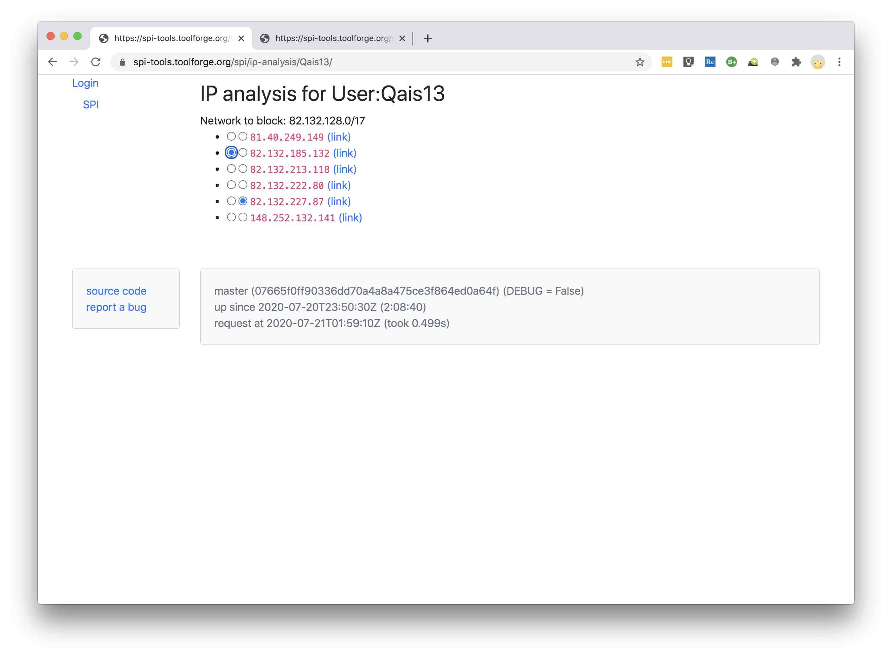
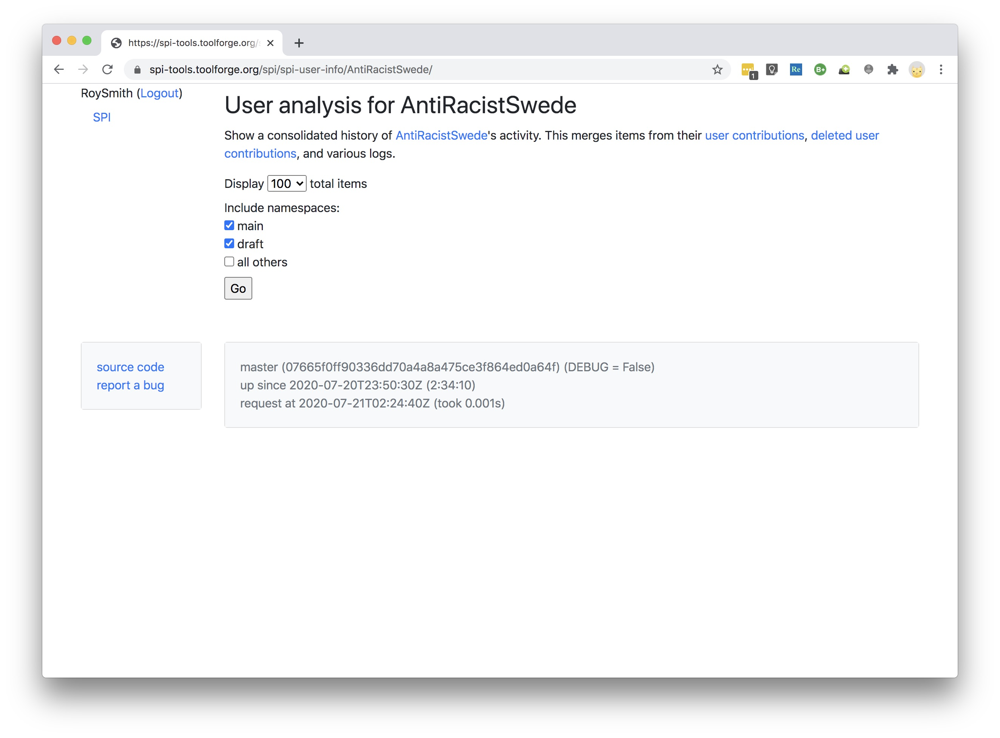
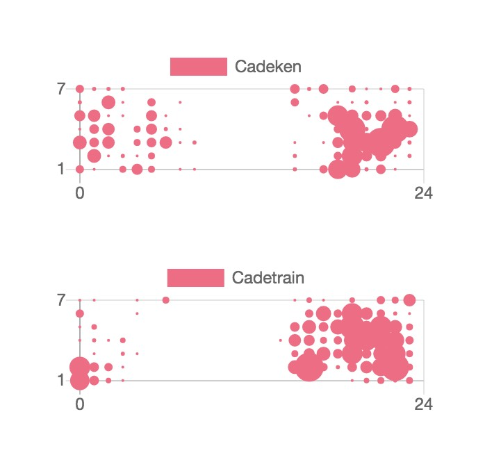

# SPI Tools

This is a collection of utilities to help process wikipedia
sock-puppet investigations, specifically [on
enwiki](https://en.wikipedia.org/wiki/Wikipedia:Sockpuppet_investigations).
This is very much a work in progress; expect things to break, to be
missing, to be confusing, etc.  Please file bug reports.

## Quick Start

Start by navigating to the SPI Tools home page,
https://spi-tools.toolforge.org/.  The big drop-down menu lists all
the currently active SPIs.  This is obtained by parsing WP:Sockpuppet
investigations/Cases/Overview on the fly.  Pick the SPI you're
interested in, and click one of the three buttons.

By default, both the current SPI page and the archive (if it exists)
are pulled in.  If the archive is large, that can be slow, so you can
uncheck "Use archive?" if you want.

### IP Info

This shows you all the IPs that have been mentioned in {{checkip}}
templates.  There's also a (rather clumsy) way to select a subset of
them and see what CIDR range would cover them.

### Sock Info

This gives you information about individual socks.  For our purposes,
a sock is any user mentioned in a {{SPIarchive notice}},
{{checkuser}}, or {{user}} template.

If you click on a username, you can start to drill down into
user-specific information.  For now, that means a composite listing of
their live and deleted edits.  There's some options you can play with;
it should be obvious what they mean.  If it's not obvious, maybe
you're not the intended audience for this tool.

### Interactions

.
You can select which ones you're interested in.  Once you've picked
the ones you want, you've got two reports you can get.

The Interaction analyser is the same Sigma tool that's linked in all
SPI reports.  The only difference is that the set of users compared is
built on the fly, instead of a static set built when the SPI report
was first generated.

The Timecard comparison shows you miniature timecards using the
X-Tools data.  You can see, for example, that Cadeken and Cadetrain
have very similar work schedules.

## Authentication

Some functions (such as listing deleted contributions) require admin
rights.  You can either login using the "Login" link at the top o the
navbar, or wait to be prompted to login when you access some function
which requires admin rights.

The tool uses [OAUTH](https://www.mediawiki.org/wiki/Help:OAuth) to
authenticate using your mediawiki credentials.  The tool only reads
data using the [mediawiki
API](https://www.mediawiki.org/wiki/API:Main_page); no edits or admin
actions (other than reading admin-restricted data) are ever performed.
The tool depends on your access permissions as conveyed via OAUTH;
logging into the tool as a non-admin won't give you admin access to
anything.

## Future directions

There's a ton of possible ways for this to grow.  Let me know what would
be useful to you.

I'll almost certainly add some sort of caching.  Parsing and
re-parsing large archive files isn't very efficient.  Some simple
caching would be a big performance win.

Merging log entries (page moves, blocks and unblocks, user group
changes, etc) into the chronological edit histories is on my short
list.
